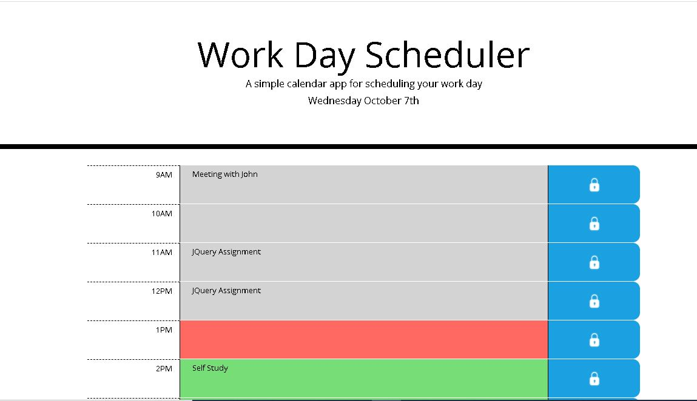

# Work Day Planner

This simple website allows users to plan a particular work day. The site is responsive and dynamic in nature. 

The time of the day is color coded, i.e
- Grey for hours passed.
- Red for the current hour.
- Green for the future hour.

Users can assign ToDo tasks during the work hours. The tasks are also stored in Local Storage so that the data is not lost on refresh or when the browser is closed.

---
### Screen shots
---

---

- [Github link](https://github.com/arpita-sahakar/day-planner-assignment-05)

- [Live Website](https://arpita-sahakar.github.io/day-planner-assignment-05/)
